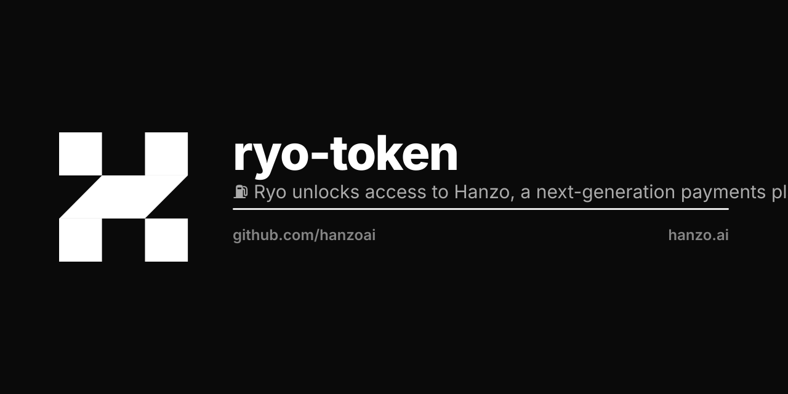

# Ryo

[![npm][npm-img]][npm-url]
[![build][build-img]][build-url]
[![dependencies][dependencies-img]][dependencies-url]
[![license][license-img]][license-url]
[![chat][chat-img]][chat-url]

> Ryo is rocket fuel for blockchain companies.

Ryo unlocks access to [Hanzo](https://hanzo.ai), a next-generation
payments platform. Use RYO to launch blockchain nodes, deploy secure smart
contracts, query data from the blockchain and more.

Users can purchase Ryo through [ryo.hanzo.ai](https://ryo.hanzo.ai), which is
powered by [Hanzo](https://hanzo.ai) and [Coin.js](https://github.com/hanzoai/coin.js).

# About Hanzo
[Hanzo][hanzo] enables businesses to launch and operate blockchain networks,
develop decentralized applications and deliver compelling experiences.

## License
Licensed under [MIT](LICENSE-MIT) or [Apache-2.0](LICENSE-APACHE), at your option — per HIP-0137.

[hanzo]:            https://hanzo.ai
[solidity]:         https://solidity.readthedocs.io
[truffle]:          http://truffleframework.com/
[tests]:            https://github.com/hanzoai/contracts/tree/master/test

[build-img]:        https://img.shields.io/travis/hanzoai/contracts.svg
[build-url]:        https://travis-ci.org/hanzoai/contracts
[chat-img]:         https://badges.gitter.im/join-chat.svg
[chat-url]:         https://gitter.im/hanzoai/contracts
[dependencies-img]: https://david-dm.org/hanzoai/contracts.svg
[dependencies-url]: https://david-dm.org/hanzoai/contracts
[downloads-img]:    https://img.shields.io/npm/dm/contracts.svg
[downloads-url]:    http://badge.fury.io/js/contracts
[license-img]:      https://img.shields.io/npm/l/@hanzo/contracts.svg
[license-url]:      https://github.com/hanzoai/contracts/blob/master/LICENSE
[npm-img]:          https://img.shields.io/npm/v/@hanzo/contracts.svg
[npm-url]:          https://www.npmjs.com/package/@hanzo/contracts
